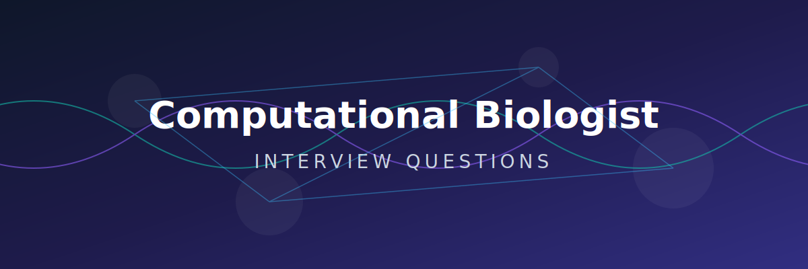

<div align="center">
  
</div>

# 🧬 Computational Biologist Interview Questions 🧫💻

<p align="center">
  <a href="https://github.com/ishandutta2007/Awesome-Awesome-Awesome"></a><a href="https://discord.gg/jc4xtF58Ve"></a><a href="https://github.com/ishandutta2007"></a>
</p>

A curated, community-driven collection of interview questions (with model answers, frameworks, and explanations) for **Computational Biologist** roles — spanning academic research labs 🧪, biotech/pharma 💊, structural biology groups 🔬, and systems biology teams 🌐.

This is not a list of trivia. Every question includes:
- 🎯 **Why interviewers ask it**
- 📝 **A model answer or framework**
- 🔍 **Follow-up questions** interviewers commonly use to probe deeper

> 🌱 This is v1. Contributions, corrections, and new questions are very welcome — see [CONTRIBUTING.md](CONTRIBUTING.md).

> ⚠️ **Note on scope:** "Computational biologist" is a broad title that means different things at different organizations — this repo leans toward core algorithms 📊, sequence/structure/systems modeling 🧬, and scientific computing practice 💻, complementing (rather than duplicating) companion repos on **Genomics Data Scientist** roles (more NGS-pipeline/statistics-focused) and **AI Drug Discovery Scientist** roles (more pharma/cheminformatics-focused), if you have access to those. If your target role sits closer to those descriptions, check those out too.

---

## 📚 Table of Contents

| # | Category | What it covers |
|---|----------|-----------------|
| 1 | 🧮 [Core Algorithms & Fundamentals](questions/01-core-algorithms-and-fundamentals.md) | Sequence alignment, dynamic programming, complexity, core data structures |
| 2 | 🧬 [Sequence Analysis & Phylogenetics](questions/02-sequence-analysis-and-phylogenetics.md) | Multiple sequence alignment, phylogenetic trees, molecular evolution |
| 3 | 🔬 [Structural Bioinformatics & Molecular Simulation](questions/03-structural-bioinformatics-and-simulation.md) | Protein structure prediction, molecular dynamics, docking |
| 4 | 🌐 [Systems Biology & Network Modeling](questions/04-systems-biology-and-network-modeling.md) | Gene regulatory networks, pathway analysis, dynamical models |
| 5 | 📈 [Statistical Modeling & Machine Learning](questions/05-statistical-modeling-and-machine-learning.md) | Model selection, overfitting in small-sample biology, ML applications |
| 6 | 💻 [Scientific Computing & Reproducibility](questions/06-scientific-computing-and-reproducibility.md) | HPC, pipelines, software engineering practices, reproducible research |
| 7 | 🧪 [Experimental Design & Wet-Lab Collaboration](questions/07-experimental-design-and-collaboration.md) | Working with experimentalists, hypothesis-driven analysis, validation |
| 8 | 🧠 [Behavioral & Case Studies](questions/08-behavioral-and-case-studies.md) | Real-world scenarios, cross-functional collaboration, ambiguous problems |

Also see: 🔗 [resources.md](resources.md) for external reading, tools, and communities.

---

## 🧭 How to Use This Repo

- 💻 **Coming from a pure CS/math/physics background moving into biology?** Prioritize sections 2, 3, and 4 to build biological domain fluency — your algorithmic background will translate, but the biological framing needs deliberate study.
- 🧪 **Coming from a wet-lab biology background moving into computation?** Prioritize sections 1, 5, and 6 — the goal is building comfort with algorithmic thinking, statistical rigor, and software engineering practices.
- 🔬 **Interviewing for a structural biology-focused role?** Focus heavily on section 3.
- 🌐 **Interviewing for a systems/synthetic biology-focused role?** Focus heavily on section 4.
- 🏫 **Interviewing at an academic lab?** Expect more emphasis on sections 1, 2, and 7 (hypothesis-driven, method-development-oriented questions).
- 🏢 **Interviewing at a biotech/industry computational biology team?** Expect more emphasis on sections 5, 6, and 8 (production rigor, cross-functional collaboration, scalability).

Each question is tagged with a rough difficulty and role-level indicator:
- 🟢 Junior/PhD-level entry · 🟡 Mid-level Scientist · 🔴 Senior/Principal Scientist

---

## 🗂 Repo Structure

```text
computational-biologist-interview-questions/
├── README.md                                          ← 📍 you are here
├── CONTRIBUTING.md                                    ← 🤝 how to contribute
├── LICENSE                                            ← 📄 MIT license
├── resources.md                                       ← 📚 study materials
└── questions/                                         ← ❓ the interview questions
    ├── 01-core-algorithms-and-fundamentals.md
    ├── 02-sequence-analysis-and-phylogenetics.md
    ├── 03-structural-bioinformatics-and-simulation.md
    ├── 04-systems-biology-and-network-modeling.md
    ├── 05-statistical-modeling-and-machine-learning.md
    ├── 06-scientific-computing-and-reproducibility.md
    ├── 07-experimental-design-and-collaboration.md
    └── 08-behavioral-and-case-studies.md
```

## 🤝 Contributing

PRs are the whole point of this repo 🚀. If you were asked a question in a real interview that isn't here, add it! See [CONTRIBUTING.md](CONTRIBUTING.md) for format guidelines.

## 📄 License

Content is available under [MIT License](LICENSE) ⚖️ — use it freely for your own prep, mock interviews, or hiring loops.

## ⭐ Support

If this helped you land an offer 🎉, consider starring the repo ⭐️ and adding the question that stumped you — it might help the next person.
